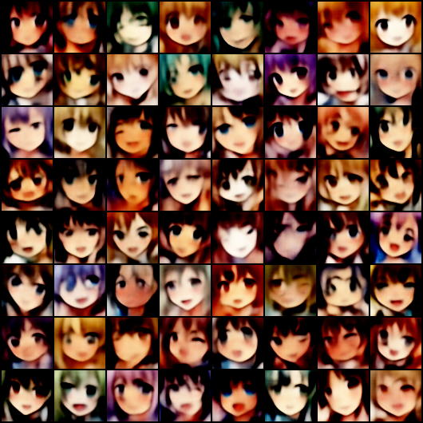

# Anime Face Customization

Customize anime faces through the latent space of a Variational Autoencoder (VAE).

Built with Pytorch, Using Danbooru2018 Dataset.

## Examples

## Requirements:

- Pytorch
- Visdom
- lbpcascade_animeface
- Collection of anime-style images (Danbooru2018)

## Insights:

- When using plain VAE, balancing the KL Divergence and the MSE Loss is hard. Images tend to be blurry.
- With RMSprop and fine tuning convergence is really slow at the end

## References:

- https://www.gwern.net/Danbooru2018
- https://github.com/ecrows/danbooru-faces
- https://github.com/nagadomi/lbpcascade_animeface
- https://github.com/wuga214/IMPLEMENTATION_Variational-Auto-Encoder

